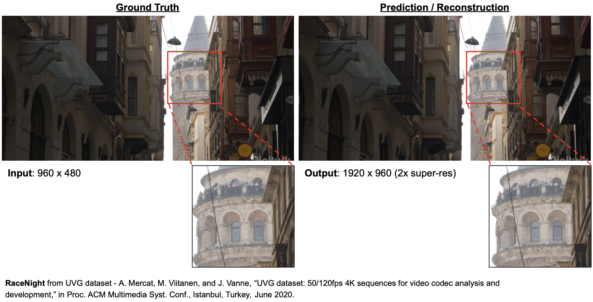

<br />
<p align="center">

<h1 align="center">🥦 <b>Broccoli</b> <br> Efficient Video Encoding with Neural Implicit Representation
</h1>
  <h4 align="center"><a href="https://github.com/datacrisis">Keifer Lee</a>, <a href="">Ankit Rajvanshi</a>, <a href="">Utkarsh Atri</a>, <a href="">Yueyu Hu </a>(Mentor) </h4>
  
  <h5 align="center"><a href="https://docs.google.com/presentation/d/17Vl2SLQFEUfY_zYlgTjfzdY43zZ397gmQey7Jv0UCr8/"> Slide </a> &emsp; <a href=""> Report </a></h5>
</p>

 
## Introduction 
> **Note**: For ECE 6123 – Image and Video Processing (Spring 2023) at NYU

<p align="center">
<b>Left: </b>Ground Truth <b>Right: </b>2x Super-Resolution Reconstructed Output
</p>

### Results & Sample Weights
Below is an illustration of the input / output at each stage of the pipeline with custom data.

<p align="center">
<b>Sample data at each stage. From left to right - Monocular input sequence, SAM extracted mask, NeRF2Mesh reconstructed mesh and test-fit with cloth simulation in Blender</b>
</p>

Sample data used in illustration above and the corresponding trained implicit model and reconstructed mesh can be found [here](https://drive.google.com/file/d/1nKHaewiDw_M1wOnBDXXRA_i0nXSzp8LR/view?usp=share_link)


## Getting Started

### Installation
The following are the key dependencies of of `Broccoli`. To reproduce the results, you would need the `UVG Dataset`, otherwise feel free to use any data of your choice.

```python
pip install -r requirements.txt
pip install brotli
```

### Running Broccoli
1. To begin, we assume that the input video to be encoded has already been converted to a sequence of RGB image frames; considering to add direct YUV parsing and support in the future. One convenient way to do so is by using `ffmpeg`.

2. Run Broccoli, which has to be done in 2 steps as follow
```bash
#Example with 2x super-resolution with output size of 1920x960
#Fit
python ../main.py --data_path path/to/images \
                  --batchSize 1 \
                  --vid output_name \
                  --outf output/path/ \
                  --crop_list 960_1920 \
                  --loss L2 \
                  --enc_strds 5 4 4 2 2 \
                  --dec_strds 5 4 4 2 2 \
                  --ks 0_1_5 \
                  --epochs 300 \
                  --eval_freq 2 \
                  --lower_width 12 \
                  --super \
                  --super_rate 2 \
                  --quant_model_bit 32 \
                  --dump_images 
```
```bash
#Brotli to compress weights
brotli -q 11 -o /path/to/output.br /path/to/quant_vid.pth
```

3. All done!

## Acknowledgements & References
The project is built on top of HNerV from Chen et. al. [here](https://github.com/haochen-rye/HNeRV).

```@InProceedings{chen2022hnerv,
      title={{HN}e{RV}: Neural Representations for Videos}, 
      author={Hao Chen and Matthew Gwilliam and Ser-Nam Lim and Abhinav Shrivastava},
      year={2022},
}
```
